<p align="center">
  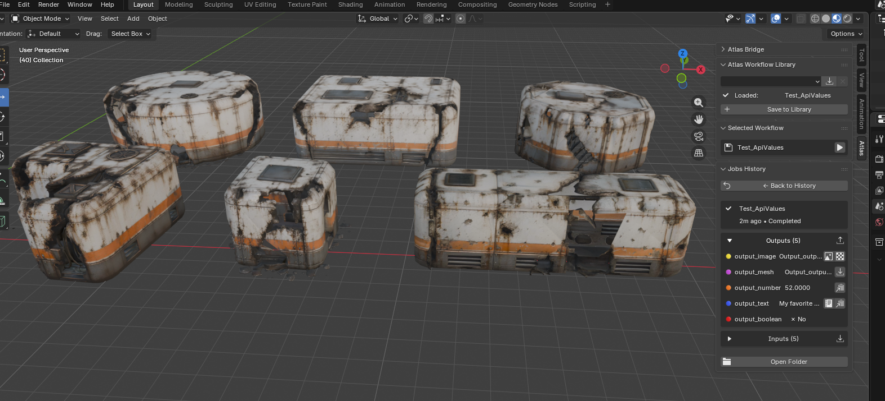
</p>

<h1 align="center">Atlas Workflow for Blender</h1>

<p align="center">
  <strong>Run Atlas Platform workflows inside Blender — no coding required</strong>
</p>

<p align="center">
  
  
  
  
</p>

<p align="center">
  <a href="#what-this-is">What this is</a> •
  <a href="#atlas-workflow-panel">Workflow panel</a> •
  <a href="#jobs-history">Job history</a> •
  <a href="#installation">Installation</a> •
  <a href="#quick-start">Quick Start</a> •
  <a href="#settings">Settings</a> •
  <a href="#troubleshooting">Troubleshooting</a>
</p>

---

## What this is

**Atlas Workflow for Blender** connects Blender to **Atlas Platform**. You load a workflow JSON your team or Atlas provides, fill in the fields, press run, and get results back inside Blender.

The addon lives in Blender's 3D View sidebar under the **Atlas** tab. It handles file uploads, async execution, result downloads, and local job history so you can focus on creative iteration.

---

## What you can do

- **Run an Atlas workflow** from **3D View Sidebar (`N`) > Atlas**.
- **Use Blender scene data or files** for image and mesh inputs.
- **Set primitive inputs** such as text prompts, numbers, and booleans.
- **Watch progress** while the job runs without freezing Blender.
- **Review outputs later** in **Jobs History**.
- **Bring results into the scene** by importing generated meshes, previewing generated images on planes, applying generated images as materials, and copying generated text.
- **Atlas Platform API v0.2** support with workspace API key auth, async polling, and version-aware upload/download URLs.

> **Note:** You need an internet connection, a workspace API key for API v0.2+ workflows, and access to Atlas Platform. Import workflow JSON exported from Atlas Platform.

---

## Atlas Workflow Panel

**Location:** open the 3D View sidebar with `N`, then select the **Atlas** tab.

This is the main panel for one workflow at a time: pick what to run, fill in inputs, start execution, and open past results.

| Area | What it is for |
| --- | --- |
| **Atlas Workflow Library** | Load a workflow JSON, switch between saved workflows, save the active workflow to the local library, or remove a local workflow. |
| **Selected Workflow** | Shows the current workflow. Inputs are expanded by default; output preview is collapsed until you need it. |
| **Inputs** | Type-aware fields for image, mesh, number, boolean, and text values. Image and mesh inputs can come from the scene or from files. |
| **Outputs** | Preview of what the workflow will return. Results appear in job history after a successful run. |
| **Run button** | Starts the selected workflow with the current inputs. The button label includes the workflow name. |

<p align="center">
  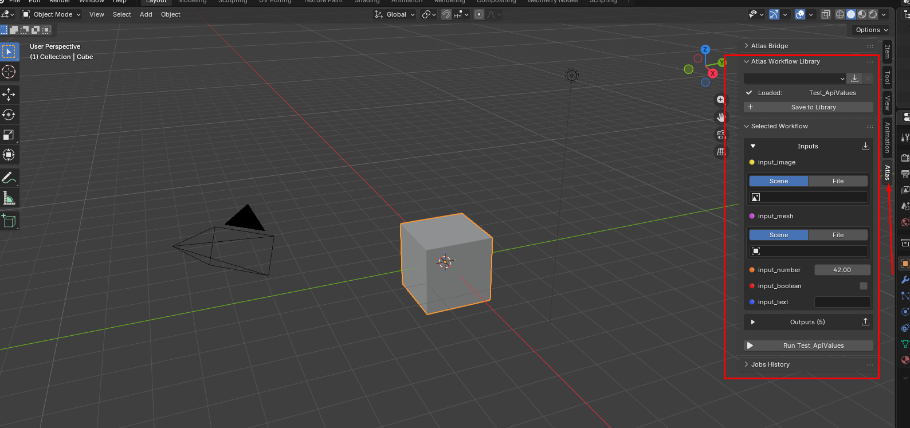
  <br/>
  <em>Atlas tab in Blender's 3D View sidebar.</em>
</p>

<p align="center">
  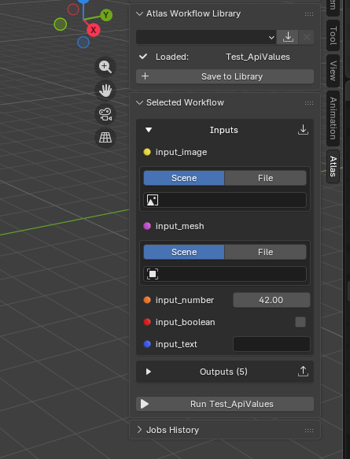
  <br/>
  <em>Workflow loaded and ready to run.</em>
</p>

<p align="center">
  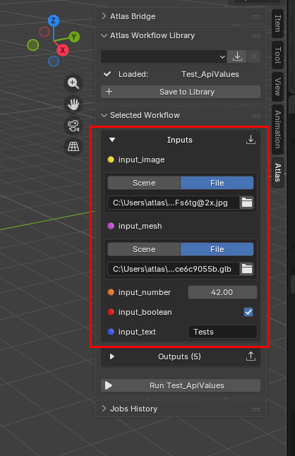
  <br/>
  <em>Type-aware input controls for files, scene data, and primitive values.</em>
</p>

### Typical flow

1. Click the import button in **Atlas Workflow Library**.
2. Choose a workflow JSON exported from Atlas Platform.
3. Select scene objects or files for image and mesh inputs.
4. Fill in text, number, and boolean inputs.
5. Click **Run [Workflow Name]**.
6. Review the completed run in **Jobs History**.

<p align="center">
  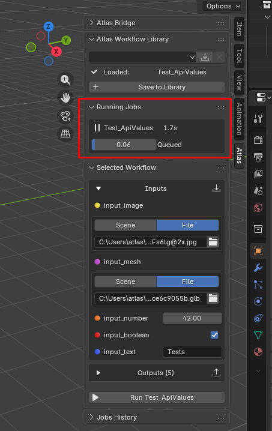
  <br/>
  <em>Running Jobs shows current execution status and progress.</em>
</p>

---

## Jobs History

**Location:** **3D View Sidebar (`N`) > Atlas > Jobs History**.

Jobs History is where you review current and past workflow runs. The history panel has a compact list view and a detail view for the selected job.

| Area | What it is for |
| --- | --- |
| **History list** | Browse previous jobs with status and relative time. |
| **Job detail** | Inspect one job. Outputs are shown first; inputs are collapsed by default to save vertical space. |
| **Output actions** | View or apply image outputs, import mesh outputs, copy number/text outputs, and open full text in a dialog. |
| **Open Folder** | Opens the local job folder containing `job.json`, inputs, and downloaded outputs. |

<p align="center">
  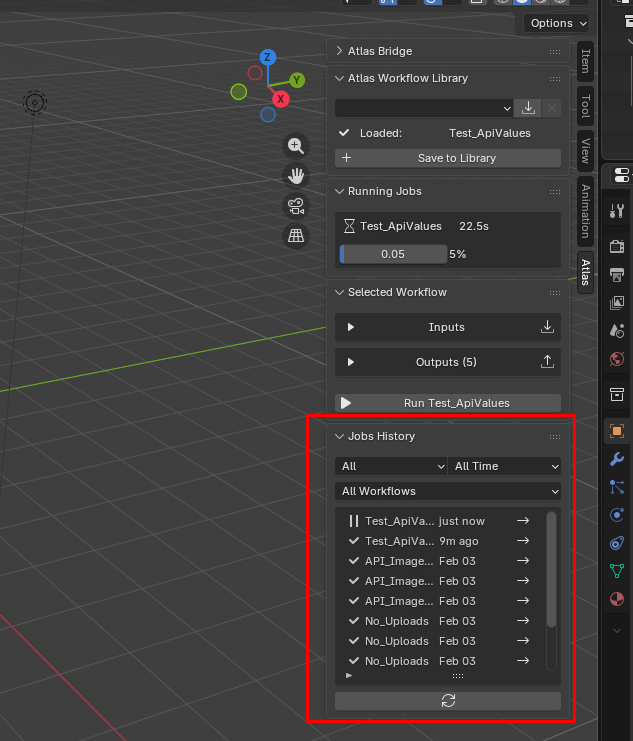
  <br/>
  <em>History list for completed, failed, and running jobs.</em>
</p>

<p align="center">
  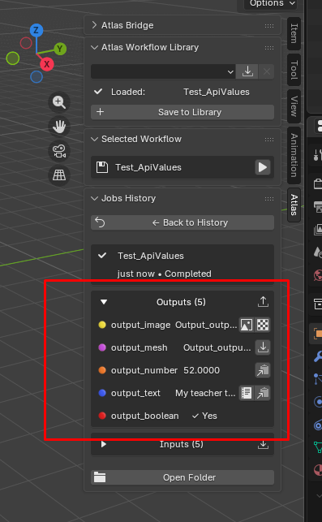
  <br/>
  <em>Job detail prioritizes outputs, with inputs collapsed by default.</em>
</p>

### Working with outputs

- **Image > View** creates a plane with the same aspect ratio as the image, assigns a texture material, and switches supported viewports to Material Preview.
- **Image > Apply** creates a new material from the image and assigns it to the selected object.
- **Mesh > Import** imports the generated GLB into the scene.
- **Text > View** opens the full generated text in a dialog.
- **Copy** actions copy text or primitive values to the clipboard.

<p align="center">
  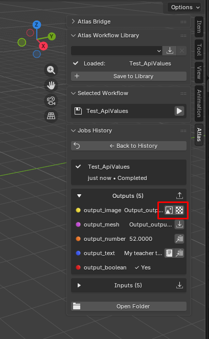
  <br/>
  <em>Image outputs can be previewed as planes or applied as materials.</em>
</p>

<p align="center">
  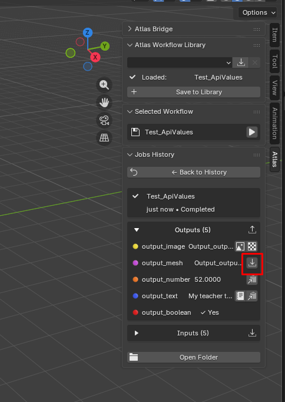
  <br/>
  <em>Generated mesh imported into the Blender scene.</em>
</p>

<p align="center">
  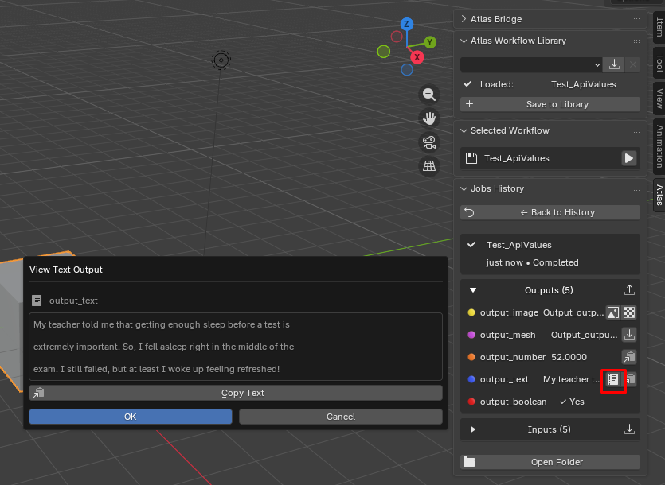
  <br/>
  <em>Full text outputs open in a compact dialog with copy support.</em>
</p>

---

## Requirements

| Requirement | Version / notes |
| --- | --- |
| **Blender** | 4.0 or newer |
| **Atlas Platform** | Access to workflows exported from your workspace |
| **Workspace API key** | Required for API v0.2+ workflows. Create one in Atlas **Workspace settings > API Keys**. |
| **Python `requests`** | Must be available in Blender's Python environment |
| **Network access** | The addon calls Atlas Platform over HTTPS |

---

## Installation

1. Download or clone this repository.
2. In Blender, open **Edit > Preferences > Add-ons**.
3. Click **Install...** and select the addon folder or zip.
4. Enable **Atlas Workflow Integration**.
5. Open the 3D View sidebar with `N`, then select the **Atlas** tab.

### Installing `requests`

If Blender reports that `requests` is missing, install it into Blender's bundled Python. On Windows, the command usually looks like:

```powershell
"C:\Program Files\Blender Foundation\Blender 4.0\4.0\python\bin\python.exe" -m ensurepip
"C:\Program Files\Blender Foundation\Blender 4.0\4.0\python\bin\python.exe" -m pip install requests
```

Adjust the path for your Blender version and install location.

---

## Quick Start

#### Step 1: Configure your API key

Open **Edit > Preferences > Add-ons > Atlas Workflow Integration** and set:

- **Workspace API Key** — your Atlas workspace key (`atk_...`), from **Workspace settings > API Keys** on the platform.
- Or leave the field empty and set `API_KEY` before launching Blender.

API v0.2+ workflow runs fail immediately if no key is configured.

<p align="center">
  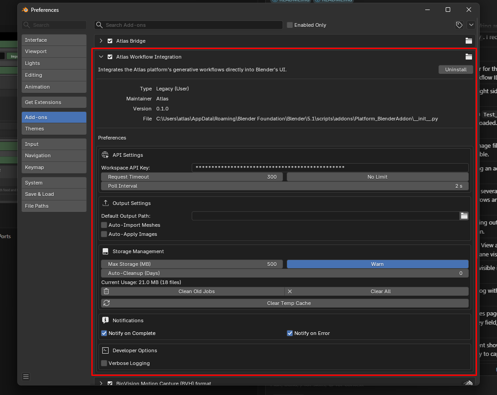
  <br/>
  <em>Addon preferences for API key, timeout, polling, output behavior, and storage.</em>
</p>

#### Step 2: Open the Atlas tab

Open a 3D View, press `N`, and choose the **Atlas** tab.

#### Step 3: Import a workflow

1. Click the import button in **Atlas Workflow Library**.
2. Choose a workflow JSON exported from Atlas Platform.
3. The workflow appears in the library and the **Selected Workflow** panel.

<p align="center">
  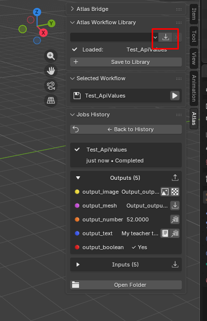
  <br/>
  <em>Import a workflow JSON exported from Atlas Platform.</em>
</p>

#### Step 4: Configure and run

1. Fill in inputs.
2. Click **Run [Workflow Name]**.
3. Wait for the job to complete.
4. Open **Jobs History** and use output actions to bring results into your scene.

---

## Settings

Open **Edit > Preferences > Add-ons > Atlas Workflow Integration**.

| Setting | Default | Description |
| --- | --- | --- |
| **Workspace API Key** | Empty | Bearer token for Atlas Platform (`atk_...`). Required for API v0.2+ workflows. |
| **Request Timeout** | 300 seconds | Per-request HTTP timeout. Set to `0` or enable no limit for long requests. |
| **Poll Interval** | 2 seconds | How often the addon checks async job status. |
| **Default Output Path** | Empty | Empty means outputs stay in each job history folder. |
| **Auto-Import Meshes** | Off | Automatically import mesh outputs after a successful run. |
| **Auto-Apply Images** | Off | Automatically apply image outputs to the active object. |
| **Max Storage** | 500 MB | Warning threshold for local job history storage. |
| **Notifications** | On | Blender reports when jobs complete or fail. |
| **Verbose Logging** | Off | Extra console output for troubleshooting. |

Keys are sent as `Authorization: Bearer <key>` on upload, execute, status, and download requests.

---

## Workflow JSON Files

Workflow JSON files describe the Atlas API endpoint, input controls, and expected outputs. In normal use, your team or Atlas provides these files.

Example workflow templates live in `examples/`. Replace placeholder `api_id` values with real Atlas workflow API IDs before running them.

Supported types:

| Type | Blender UI | Output behavior |
| --- | --- | --- |
| `boolean` | Checkbox | Shows Yes/No and stores value in job history. |
| `number` | Number field | Shows numeric value and copy action. |
| `string` | Text field | Shows preview, full-text dialog, and copy action. |
| `image` | Scene image or local image file | Downloads image output, supports View and Apply. |
| `mesh` | Scene object or local GLB/GLTF file | Downloads GLB output and supports Import. |

API v0.2 workflows require `version`, `api_id`, `base_url`, `name`, `inputs`, and `outputs`.

---

## Data Stored Locally

The addon creates local folders while you work:

```text
atlas_workflows/      Saved local workflow library
atlas_jobs/           Job history, job.json files, inputs, outputs
atlas_workflow_*      Temporary upload/download folders in the system temp directory
```

These folders are local user data and are intentionally ignored by Git.

---

## Repository Layout

```text
AtlasPlatform_BlenderAddon/
  __init__.py          Blender addon entrypoint
  atlas/               Runtime implementation modules
  examples/            Sanitized workflow JSON templates
  icons/               Custom icon assets
  README.md
  LICENSE
```

Runtime implementation modules are intentionally grouped under `atlas/`; `__init__.py` stays at the repository root because Blender uses it as the addon entrypoint.

---

## Troubleshooting

### Authentication

#### API key required / run blocked before it starts

**Possible causes:**

- No API key in addon preferences.
- API v0.2+ workflow but empty key field and no `API_KEY` environment variable.

**Solutions:**

1. Set **Workspace API Key** in addon preferences, or set `API_KEY` before launching Blender.
2. Create a new key in Atlas **Workspace settings > API Keys**.
3. Confirm the workflow JSON belongs to the same workspace as the key.

#### HTTP 401 or 403

**Possible causes:**

- Invalid or revoked API key.
- Workflow JSON from a workspace your key cannot access.

**Solutions:**

1. Re-copy the key from Atlas.
2. Re-import a workflow JSON exported from your workspace.
3. Ask your team to confirm workspace access.

### Common issues

| Problem | What to try |
| --- | --- |
| `requests` is missing | Install `requests` into Blender's Python environment. |
| Workflow JSON will not load | Confirm it includes the required fields and supported parameter types. |
| Input file is missing | Re-select the image or mesh file in the input row. |
| Image output is not visible | Use **View**; it creates a textured plane and switches supported viewports to Material Preview. |
| Apply image does nothing | Select an object with material slots, then click **Apply** again. |
| Mesh did not import | Confirm the output file exists in the job folder and is GLB/GLTF. |
| Job history looks stale | Click refresh in **Jobs History** or rerun the workflow. |

---

## License

This project is licensed under the **MIT License**. See [LICENSE](LICENSE).

---

<p align="center">
  <strong>Built by the Atlas team</strong>
</p>
